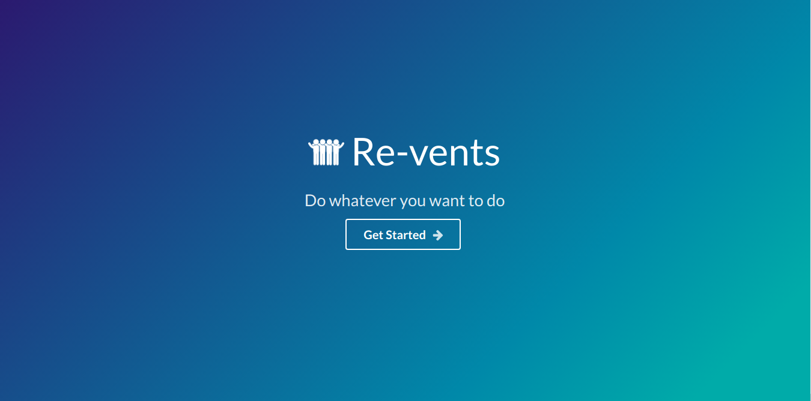
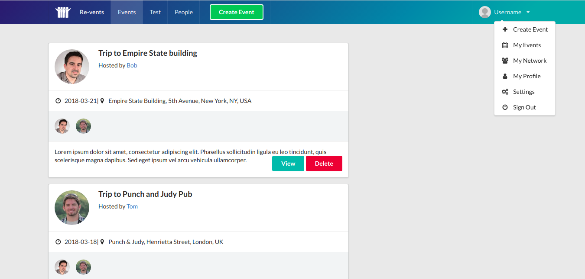
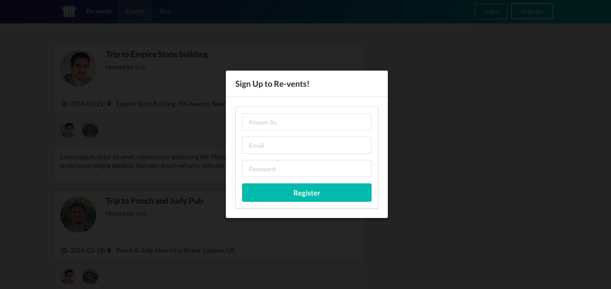
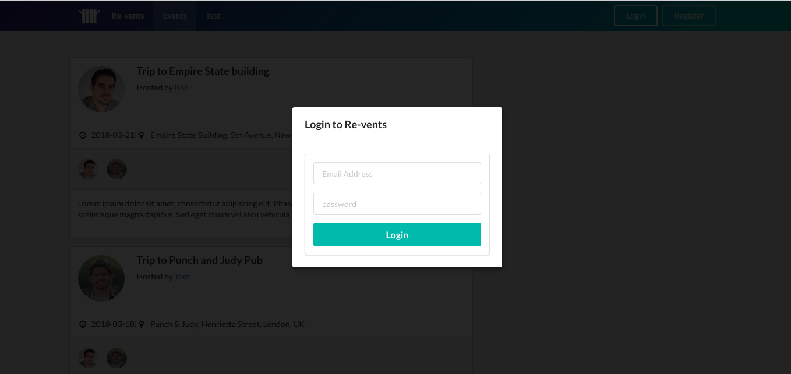
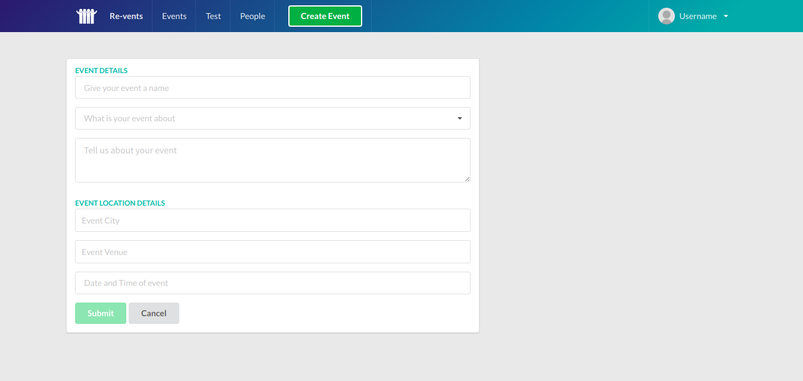
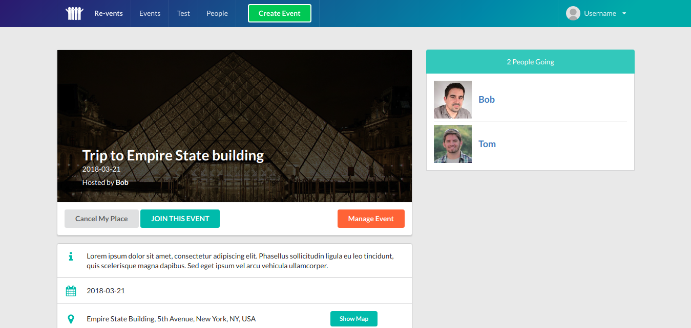
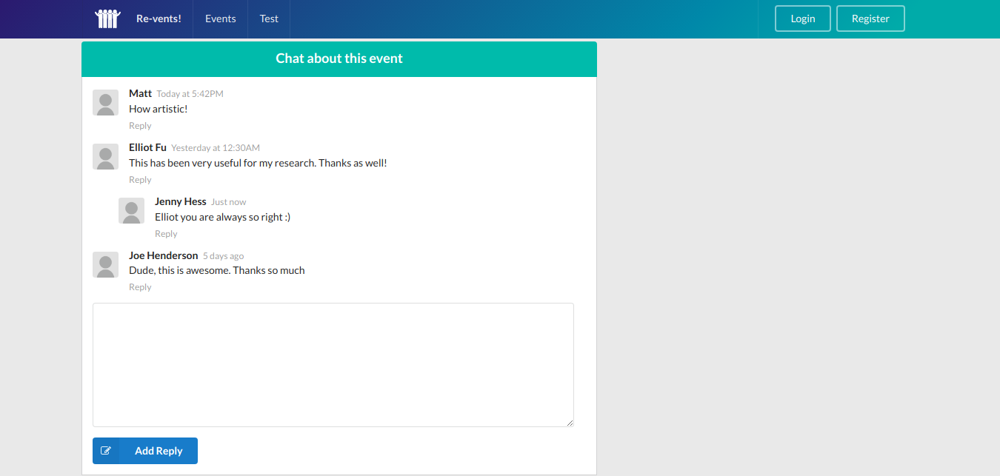
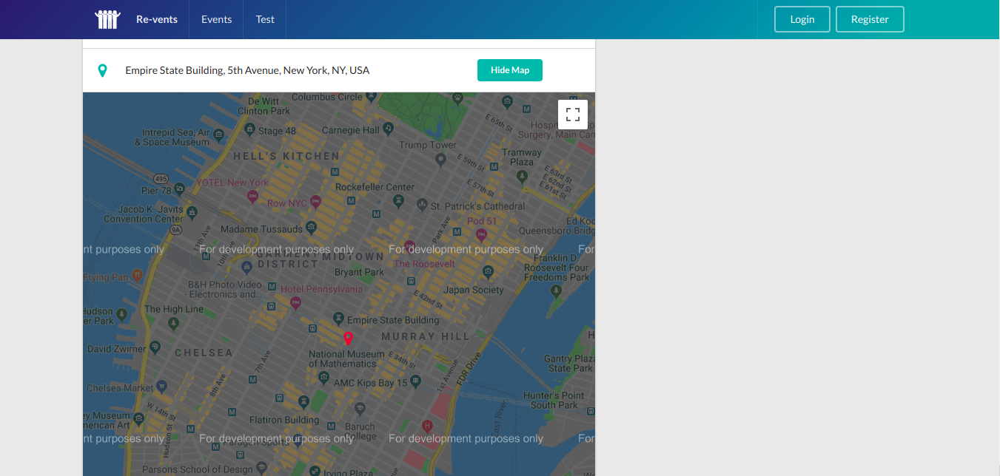

# react-firebase-events-board

## node and npm version
* node version 8.11.4 LTS  
* npm version 5.6.0  

## Global install packages
* create-react-app  

## VScode packages
* Auto Rename Tag  
* Bracket Pair Colorizer  
* Debugger for Chrome  
* ES7 React/Redux/GraphQL/React-Native snippets  
* ESLint  
* JavaScript(ES6) code snippets  
* Material Icon Theme  
* npm Intellisense  
* Path Intellisense  
* Prettier-Code formatter  
* React Redux Firestore Course Snippets  

## VScode Setting

setting.json

```
{
    "workbench.startupEditor": "newUntitledFile",
    "editor.tabSize": 2,
    "explorer.confirmDragAndDrop": false,
    "workbench.iconTheme": "material-icon-theme",
    "emmet.includeLanguages": {
        "javascript": "javascriptreact"
    },
    "emmet.triggerExpansionOnTab": true
}
```

## stack
* React16  
* Redux  
* Firebase  
* etc

## GCP stack
* Maps JavaScript API  
* Places API  
* Geocoding API  

## Views















