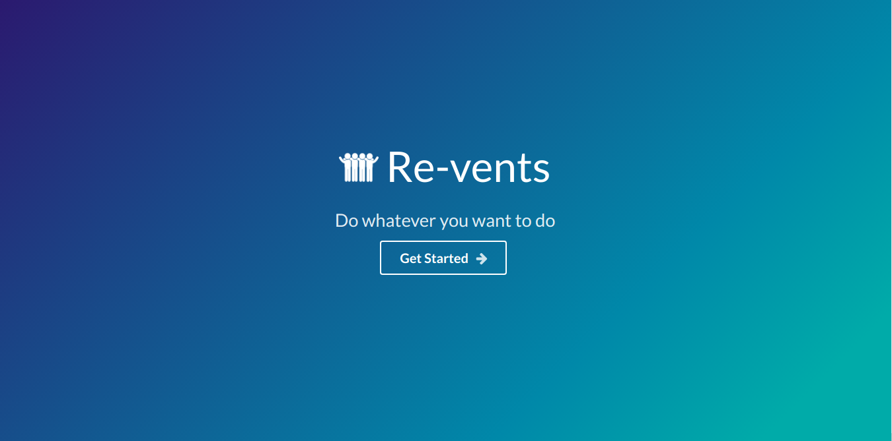
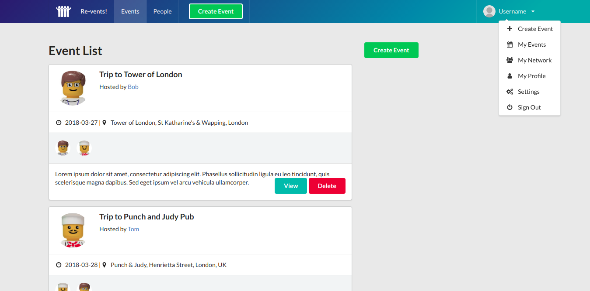
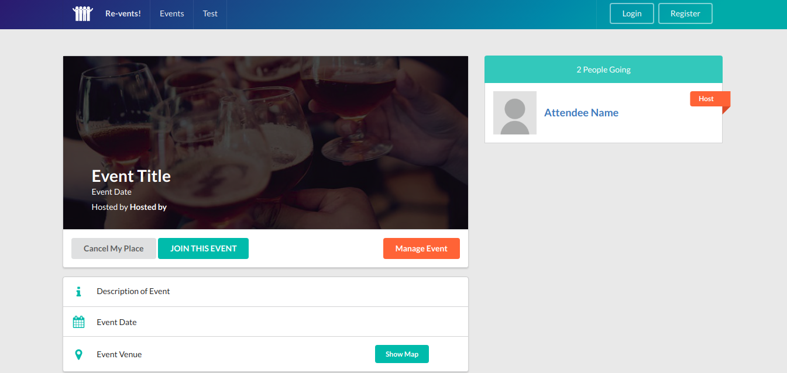

# react-firebase-events-board

## node and npm version
* node version 8.11.4 LTS  
* npm version 5.6.0  

## Global install packages
* create-react-app  

## VScode packages
* Auto Rename Tag  
* Bracket Pair Colorizer  
* Debugger for Chrome  
* ES7 React/Redux/GraphQL/React-Native snippets  
* ESLint  
* JavaScript(ES6) code snippets  
* Material Icon Theme  
* npm Intellisense  
* Path Intellisense  
* Prettier-Code formatter  
* React Redux Firestore Course Snippets  

## stack
* React16  
* Redux16  
* Firebase  
* etc

## Views

